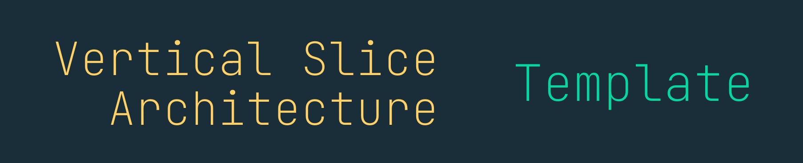

[](https://github.com/Hona/VerticalSliceArchitecture)
[](https://github.com/Hona/VerticalSliceArchitecture/actions?query=branch%3Amain)
[](https://github.com/Hona/VerticalSliceArchitecture/releases/latest)
[](https://www.nuget.org/packages/Hona.VerticalSliceArchitecture.Template)
[](https://libraries.io/nuget/Hona.VerticalSliceArchitecture.Template)
[](https://github.com/Hona/VerticalSliceArchitecture/stargazers)
[](https://github.com/Hona/VerticalSliceArchitecture/graphs/contributors)
[](https://github.com/Hona/VerticalSliceArchitecture)
[](https://github.com/Hona/VerticalSliceArchitecture/graphs/commit-activity)
[](https://github.com/Hona/VerticalSliceArchitecture/issues)

Spend less time over-engineering, and more time coding. The template has a focus on convenience, and developer confidence.

Want to see what a vertical slice looks like? [Jump to the code snippet!](#full-code-snippet)

<p align="center">
    
</p>

> [!IMPORTANT]
> This template is undergoing a rebuild, ready for version 2! 🥳 See my experimental version 1 template [here](https://github.com/SSWConsulting/SSW.VerticalSliceArchitecture)
>
> Please wait patiently as this reaches the stable version, there's many important things to finish.
>
> **Please ⭐ the repository to show your support!**
>
> If you would like updates, feel free to 'Watch' the repo, that way you'll see the release in your GitHub home feed.

<p align="center">
    
</p>

<h3 align="center"><strong>Getting started ⚡</strong></h3>

<p align="center">
    
</p>

#### dotnet CLI

To install the template from NuGet.org run the following command:

```bash
dotnet new install Hona.VerticalSliceArchitecture.Template
```

Then create a new solution:

```bash
mkdir Sprout
cd Sprout

dotnet new hona-vsa
```

Finally, to update the template to the latest version run:

```bash
dotnet new update
```

#### GUI

```bash
dotnet new install Hona.VerticalSliceArchitecture.Template
```

then create:


<h3 align="center"><strong>Features ✨</strong></h3>

<p align="center">
    
</p>

### A compelling example with the TikTacToe game! 🎮

```cs
var game = new Game(...);
game.MakeMove(0, 0, Tile.X);
game.MakeMove(0, 1, Tile.Y);
```

<p align="center">
    
</p>

### Rich Domain (thank you DDD!)

- with Vogen for Value-Objects
- with FluentResults for errors as values instead of exceptions
- For the Domain, start with an anemic Domain, then as use cases reuse logic, refactor into this more explicit Domain

```cs
[ValueObject<Guid>]
public readonly partial record struct GameId;

public class Game
{
    public GameId Id { get; init; } = GameId.From(Guid.NewGuid());

    ...
```

<p align="center">
    
</p>

### Quick to write feature slices

- Use cases follow CQRS using Mediator (source gen alternative of MediatR)
- REPR pattern for the use cases
- 1 File per use case, containing the endpoint mapping, request, response, handler & application logic
    - Endpoint is source generated
- For use cases, start with 'just get it working' style code, then refactor into the Domain/Common code.
- Mapster for source gen/explicit mapping, for example from Domain -> Response/ViewModels

`Features/MyThings/MyQuery.cs`

```cs
internal sealed record MyRequest(string Text);
internal sealed record MyResponse(int Result);

internal sealed class MyQuery(AppDbContext db)
    : Endpoint<MyRequest, Results<Ok<GameResponse>, BadRequest>>
{
    public override void Configure()
    {
        Get("/my/{Text}");
    }

    public override async Task HandleAsync(
        MyRequest request,
        CancellationToken cancellationToken
    )
    {
        var thing = await db.Things.SingleAsync(x => x.Text == Text, cancellationToken);

        if (thing is null)
        {
            await SendResultAsync(TypedResults.BadRequest());
            return;
        }

        var output = new MyResponse(thing.Value);
        await SendResultAsync(TypedResults.Ok(output));
    }
}
```

<p align="center">
    
</p>

### EF Core

- Common:
    - EF Core, with fluent configuration
    - This sample shows simple config to map a rich entity to EF Core without needing a data model (choose how you'd do this for your project)

`Common/EfCore/AppDbContext.cs`

```cs
public class AppDbContext : DbContext
{
    public DbSet<MyEntity> MyEntities { get; set; } = default!;

    ...
}
```

`Common/EfCore/Configuration/MyEntityConfiguration.cs`

```cs
public class MyEntityConfiguration : IEntityTypeConfiguration<MyEntity>
{
    public void Configure(EntityTypeBuilder<MyEntity> builder)
    {
        builder.HasKey(x => x.Id);

        ...
    }
}
```

<p align="center">
    
</p>

### Architecture Tests via NuGet package

- Pre configured VSA architecture tests, using NuGet (Hona.ArchitectureTests). The template has configured which parts of the codebase relate to which VSA concepts. 🚀

```cs
public class VerticalSliceArchitectureTests
{
    [Fact]
    public void VerticalSliceArchitecture()
    {
        Ensure.VerticalSliceArchitecture(x =>
        {
            x.Domain = new NamespacePart(SampleAppAssembly, ".Domain");
            ...
        }).Assert();
    }
}
```

<p align="center">
    
</p>

### Cross Cutting Concerns

- TODO:
    - Add ~~Mediator~~ FastEndpoints pipelines for cross cutting concerns on use cases, like logging, auth, validation (FluentValidation) etc (i.e. Common scoped to Use Cases)


## Automated Testing

<p align="center">
    
</p>

### Domain - Unit Tested

Easy unit tests for the Domain layer

```cs
[Fact]
public void Game_MakeMove_BindsTile()
{
    // Arrange
    var game = new Game(GameId.From(Guid.NewGuid()), "Some Game");
    var tile = Tile.X;
    
    // Act
    game.MakeMove(0, 0, tile);
    
    // Assert
    game.Board.Value[0][0].Should().Be(tile);
}
```

<p align="center">
    
</p>

### Application - Integration Tested

Easy integration tests for each Use Case or Command/Query

TODO: Test Containers, etc for integration testing the use cases. How does this tie into FastEndpoints now... :D

```cs
TODO
```

TODO: Section on mapping & how important the usages + used by at compile time is! (AM vs Mapperly)

<p align="center">
    
</p>

### Code - Architecture Tested

The code is already architecture tested for VSA, but this is extensible, using [Hona.ArchitectureTests](https://github.com/Hona/ArchitectureTests)

## Full Code Snippet

To demostrate the template, here is a current whole vertical slice/use case!

```cs
// 👇🏻 Vogen for Strong IDs + 👇🏻 'GameId' field is hydrated from the route parameter
internal sealed record PlayTurnRequest(GameId GameId, int Row, int Column, Tile Player);

// 👇🏻 TypedResults for write once output as well as Swagger documentation
internal sealed class PlayTurnCommand(AppDbContext db)
    : Endpoint<PlayTurnRequest, Results<Ok<GameResponse>, NotFound>>
{
    // 👇🏻 FastEndpoints for a super easy Web API
    public override void Configure()
    {
        Post("/games/{GameId}/play-turn");
        Summary(x =>
        {
            x.Description = "Make a move in the game";
        });
        AllowAnonymous();
    }

    public override async Task HandleAsync(
        PlayTurnRequest request,
        CancellationToken cancellationToken
    )
    {
        // 👇🏻 EF Core without crazy abstractions over the abstraction
        var game = await db.FindAsync<Game>(request.GameId);

        if (game is null)
        {
            await SendResultAsync(TypedResults.NotFound());
            return;
        }

        // 👇🏻 Rich Domain for high value/shared logic
        game.MakeMove(request.Row, request.Column, request.Player);
        await db.SaveChangesAsync(cancellationToken);

        // 👇🏻 Mapperly to easily get a view model with Usage chain at compile time
        var output = GameResponse.MapFrom(game);
        await SendResultAsync(TypedResults.Ok(output));
    }
}
```

If you read it this far, why not give it a star? ;) 

<p align="center">
    
</p>


<p align="center">

</p>

